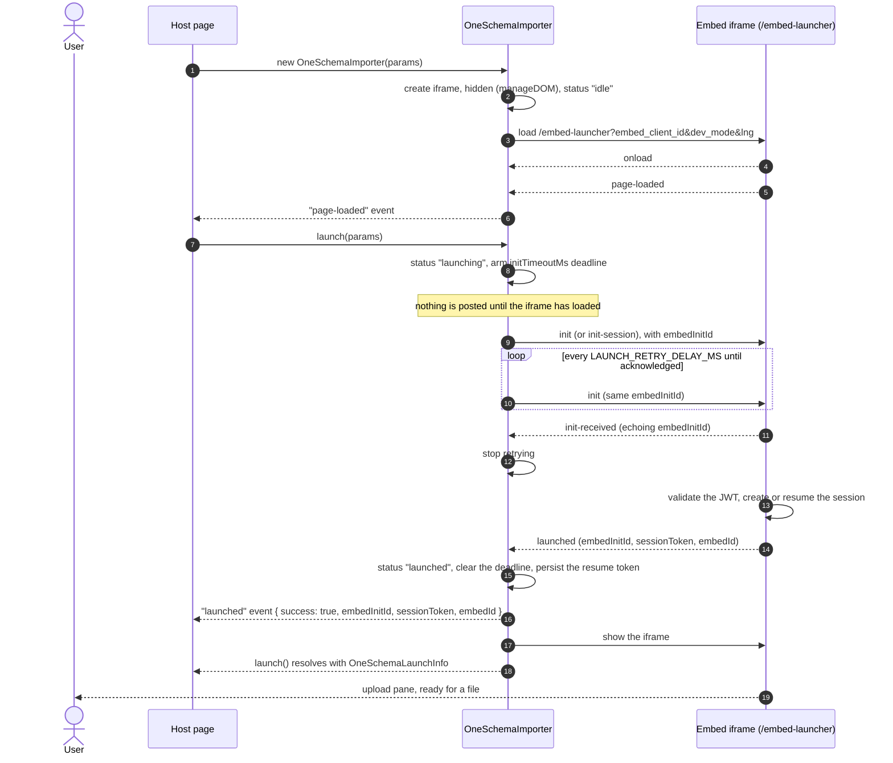
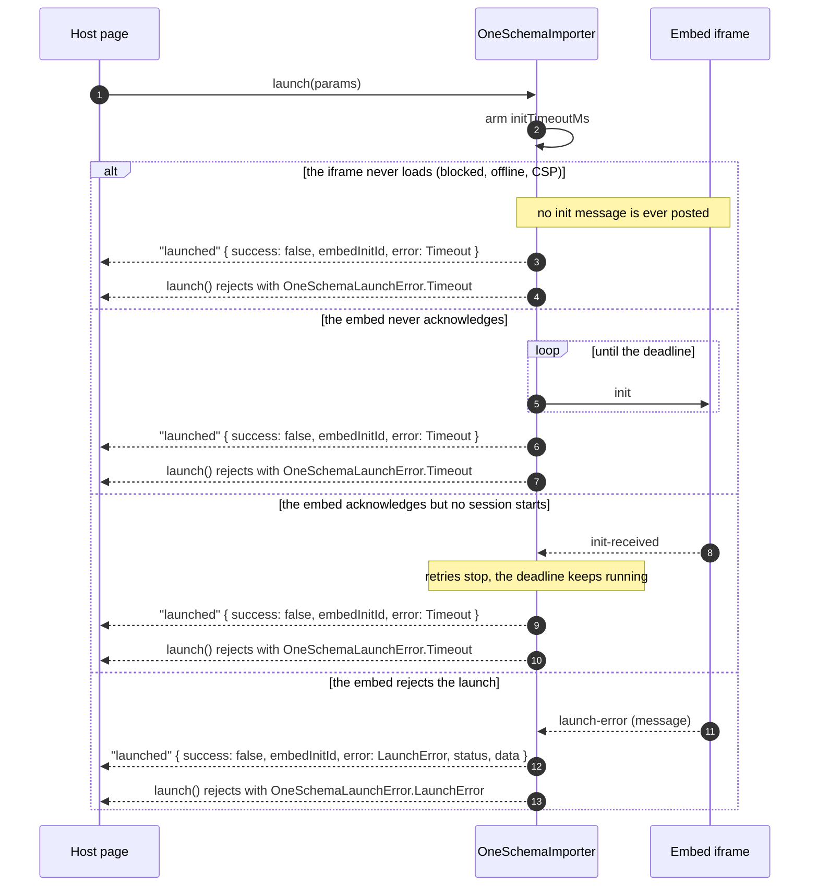
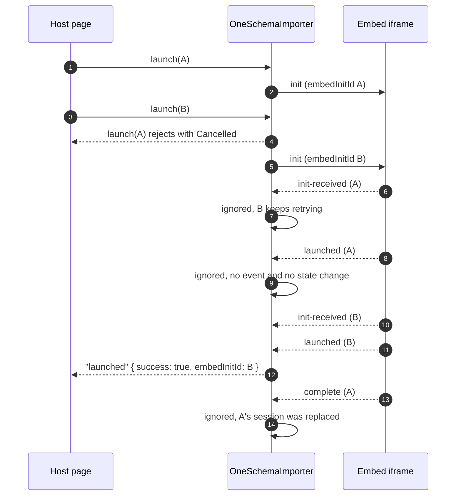

# Launch sequence

The reference for what `@oneschema/importer` and the embed exchange from construction until the user can pick a file. Every arrow is a `window.postMessage` between the host page and the embed iframe, except the host-facing calls and events, which are the SDK's own API. Keep this diagram in step with `src/importer.ts` — it is the expected behavior a bug report is measured against.

## Happy path

## What the deadline covers

`initTimeoutMs` (20 s by default) is armed by `launch()` and cleared only when the launch settles, so it bounds the whole sequence above, not just the acknowledgement:

A launch that fails before anything is posted — a missing `userJwt` or `templateKey`, or a destroyed instance — rejects synchronously with `MissingJwt`, `MissingTemplate`, `MissingSessionToken` or `Destroyed`, and fires the same `launched` failure event.

## Overlapping launches

Only one launch is in flight per instance. `close()`, `destroy()` and a newer `launch()` abandon the pending one: its promise rejects with `OneSchemaLaunchError.Cancelled` and no `launched` event fires, because the host caused it. Replies from the abandoned attempt are then attributed by embed init id, so they cannot settle or disturb the current one:

Every reply the embed sends echoes the `embedInitId` of the init message it answers, and a reply that names a different attempt — or names none at all — is dropped rather than attributed to the attempt in flight, since it may carry the session of a launch this one replaced. A reply is only read at all when it comes from this instance's iframe _and_ from the `baseUrl` origin the init messages are posted to.

## Once the session is running

The launch sequence ends where the import does not: the running session reports `user-activity`, `error`, `complete` (the tagged `success` event) and `cancel`, and `reset-embed` restarts it in place. Those are documented in [README.md](README.md) rather than here.
